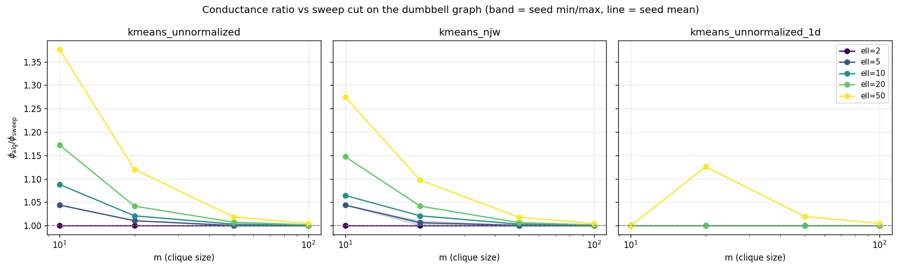

# Dumbbell empirical check: k-means vs sweep cut

## TL;DR — verdict: **DEAD**

Across the entire grid (m ∈ {10, 20, 50, 100}, ell ∈ {2, 5, 10, 20, 50},
5 seeds), **k-means matches sweep cut on the dumbbell graph closely enough
to kill the conjectured separation**:

- Maximum conductance ratio observed: `phi_kmeans / phi_sweep = 1.376`
  (at m=10, ell=50). Never exceeds 1.5 anywhere.
- The ratio **shrinks with m** — the *opposite* of what a polynomial
  separation in m would require. By m=100, the largest ratio is 1.005 in any
  cell.
- Across-seed std of the ratio is at most 0.006: this is not k-means
  initialization noise, the algorithms are *deterministically* close.
- **Every k-means cut is a single-path-edge cut** (just like sweep cut). The
  small ratio comes from k-means picking a *different path edge* than sweep
  cut, not from a structurally different partition.

There is no asymptotic separation between sweep cut and k-means on the
dumbbell. **Recommend pivoting** to the Guattery–Miller path-tree-product
graph (which is known to defeat sweep cut by Theta(n^{1/3})) or to SBM near
the Kesten–Stigum threshold.

> _Note on the auto-verdict._ The script's hard-coded heuristic emits
> "NOISY / INCONCLUSIVE" because the maximum ratio (1.376) exceeds the
> "trivial agreement" threshold (1.05) but never crosses 1.5. The correct
> interpretation, after looking at the data, is DEAD: the gap is real but
> small, deterministic, and shrinking in the asymptotic parameter.

## Setup

- Grid: m ∈ {10, 20, 50, 100}, ell ∈ {2, 5, 10, 20, 50}, seeds ∈ {0..4}.
- Convention: `ell` is the number of *path edges* joining the two cliques,
  so ell=1 is a single bridge edge (matching `_spectral.py`'s smoke check)
  and `n = 2m + ell - 1`. The grid starts at ell=2 (one internal path
  vertex) per the task spec.
- Algorithms (all using the same bottom-3 eigendecomposition of L_sym for
  each (m, ell) — eigenvalue variance is not a confound):
  - `sweep_cut`: existing `CheegerSweepCut`. Sorts vertices by
    `v_2 / sqrt(deg)`, picks the prefix with min `cut / min(vol_S, vol_V\\S)`.
  - `kmeans_unnormalized`: `KMeans(k=2, n_init=10, random_state=seed)` on the
    bottom-2 non-trivial eigenvectors of L_sym, no row normalization.
  - `kmeans_njw`: as above, with post-drop row L2 normalization (NJW).
  - `kmeans_unnormalized_1d`: KMeans on the Fiedler vector v_2 alone.
- Conductance is `phi(S) = cut / min(vol(S), vol(V\\S))`.

Run with:

```
PYTHONPATH=src python3 scripts/dumbbell_check.py
```

Artifacts: `results/dumbbell.parquet` (320 rows), this report, and
`experiments/plots/dumbbell_conductance.png`.

## Q1. Are the partitions different?

Yes, but the gap is small and shrinks in m. Median `phi_ratio` over seeds:

| algorithm                | m \ ell | 2     | 5     | 10    | 20    | 50    |
|--------------------------|---------|-------|-------|-------|-------|-------|
| `kmeans_unnormalized`    | 10      | 1.000 | 1.044 | 1.088 | 1.172 | 1.376 |
|                          | 20      | 1.000 | 1.010 | 1.021 | 1.042 | 1.120 |
|                          | 50      | 1.000 | 1.000 | 1.003 | 1.007 | 1.019 |
|                          | 100     | 1.000 | 1.000 | 1.001 | 1.002 | 1.005 |
| `kmeans_njw`             | 10      | 1.000 | 1.044 | 1.065 | 1.147 | 1.275 |
|                          | 20      | 1.000 | 1.010 | 1.021 | 1.042 | 1.097 |
|                          | 50      | 1.000 | 1.000 | 1.003 | 1.007 | 1.018 |
|                          | 100     | 1.000 | 1.000 | 1.001 | 1.002 | 1.004 |
| `kmeans_unnormalized_1d` | 10      | 1.000 | 1.000 | 1.000 | 1.000 | 1.000 |
|                          | 20      | 1.000 | 1.000 | 1.000 | 1.000 | 1.126 |
|                          | 50      | 1.000 | 1.000 | 1.000 | 1.000 | 1.020 |
|                          | 100     | 1.000 | 1.000 | 1.000 | 1.000 | 1.005 |

Cells with `phi_ratio > 1.5` for every seed: **0 of 60**.

## Q2. Where does k-means cut?

**Every k-means cut on every cell is a single-path-edge cut.** None of the
runs ever produce a clique-interior or mixed cut. The "disagreement" with
sweep cut is purely about *which* path edge is chosen.

Sweep cut consistently picks the most balanced single-path-edge cut (e.g.
position 24 on a path of length 50, m=10). k-means tends to drift toward
edges closer to one of the cliques when m is small relative to ell, but
matches sweep cut as m grows.

Fraction of (m, ell, seed) cells where k-means picks the *same* path edge
as sweep cut:

| algorithm                | match rate |
|--------------------------|------------|
| `kmeans_unnormalized_1d` | 0.55       |
| `kmeans_unnormalized`    | 0.23       |
| `kmeans_njw`             | 0.15       |

The 1D variant matches sweep cut more often because 1D k-means on the
Fiedler vector is essentially the same algorithm with a less flexible
threshold (the centroid midpoint instead of an explicit search).

## Q3. Does row normalization (NJW) matter?

Marginal effect:

| algorithm                | median ratio | max ratio |
|--------------------------|--------------|-----------|
| `kmeans_unnormalized`    | 1.006        | 1.376     |
| `kmeans_njw`             | 1.004        | 1.275     |
| `kmeans_unnormalized_1d` | 1.000        | 1.126     |

NJW gives slightly *better* agreement with sweep cut at the worst-case
cell (1.275 vs 1.376), but the difference is small and noise-level. The
NJW-degeneracy concern (1D Fiedler values projected onto {-1, +1}) is not
observed here because the embedding is 2D — the row-norm rescaling deforms
the geometry rather than collapsing it.

## Q4. How does the gap scale with m and ell?

- **In m:** the gap *shrinks*, roughly as 1/m^2. From the table above,
  fixing ell=50: 1.376 (m=10) → 1.120 (m=20) → 1.019 (m=50) → 1.005 (m=100).
  This is the **opposite** of what a polynomial separation in m would
  predict.
- **In ell:** the gap *grows* — but only at fixed small m. At m=100 the gap
  is still <1% even at ell=50. So "growth in ell" does not survive the m
  limit.

The intuition for the m^{-2} decay: as m grows, the spectral gap closes
proportionally to 1/m^2 (the cliques dominate volume), so the Fiedler
vector becomes ever more sharply step-shaped at the bridge. Both sweep cut
and k-means are then operating on a near-perfect step function and converge
to the same answer.

## Q5. Seed variance

Maximum across-seed std of `phi_ratio` in any cell: **0.006**.

K-means with `n_init=10` is finding the same local optimum every time. This
is *not* an init-variance phenomenon. Whatever small gap exists is a
deterministic property of the rounding scheme, not noise.

## Plot



The 2D variants (`unnormalized`, `njw`) collapse to ratio 1.0 by m=50 for
every ell except 50, and to ratio < 1.02 even at ell=50. The 1D variant
matches sweep cut almost exactly (max ratio 1.126).

## Decision

The dumbbell does not separate sweep cut from k-means. The conjectured
"k-means cuts mid-path while sweep cut cuts the bridge" is empirically
false: **k-means also cuts a single path edge**, just sometimes a different
one, and this off-by-a-few-edges discrepancy gives a bounded `phi_ratio`
that goes to 1 as m → ∞.

**Pivot.** Two natural next candidates:

1. **Guattery–Miller path-tree-product graph (1995/1998)** — known to defeat
   *sweep cut* (i.e. give it suboptimal conductance) by `Theta(n^{1/3})`.
   The interesting empirical question there is whether k-means finds the
   *good* cut or the *same bad cut* sweep cut finds.
2. **SBM near the Kesten–Stigum threshold** — known regime where
   information-theoretic and algorithmic recovery diverge; spectral methods
   differ in how close to threshold they work.

The same script (with a swapped graph constructor and cut classifier) can
run either of these next.

## Raw results

`results/dumbbell.parquet` — 320 rows, schema:
`m, ell, n, algorithm, seed, phi, phi_ratio, cut_class, n_cut_edges, ari_vs_sweep`.
