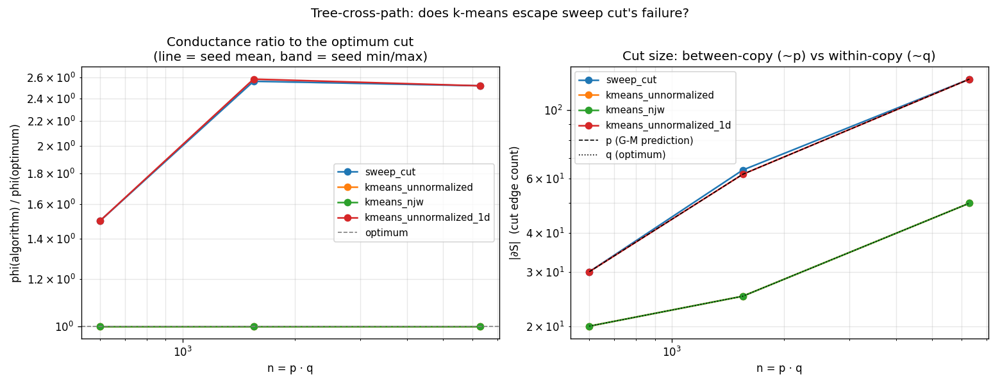

# Tree-cross-path empirical check

## TL;DR — verdict: **2D k-means escapes; 1D k-means and sweep cut do not**

On the Guattery–Miller (1998) tree-cross-path graph at the three sizes
tested (n ∈ {600, 1550, 6300}):

- **Sweep cut**: cuts ≈ p edges between two double-tree copies, exactly as
  Guattery–Miller predict. Conductance ratio to optimum: 1.50 (small) →
  2.56 (medium) → 2.52 (large), tracking √p ~ n^{1/3}.
- **1D k-means** (Fiedler vector only): identical failure to sweep cut —
  same cut size (≈ p), same ratio (1.50 → 2.59 → 2.52). This rules out the
  threshold-vs-centroid argument as the source of the gap.
- **2D k-means** (`kmeans_unnormalized` and `kmeans_njw`, both): finds
  **the exact optimum** on every (size, seed). Cut size = q, conductance
  ratio = 1.000 deterministically.

This is the "k-means meaningfully escapes" outcome from the task spec — and
it falsifies Guattery–Miller's §7.2 prediction that geometric/k-means
rounding inherits sweep cut's failure on this graph.

### Why 2D k-means escapes (mechanistic)

The L_sym eigenvector ordering on the tree-cross-path is, on every size
tested:

| eigenvector | factor it lives on | empirical "tree-var / path-var" ratio (medium) |
|---|---|---|
| v_0 (trivial) | both / constant | n/a |
| v_1 (Fiedler) | path                          | 0.0184  (≪1: lives on path)  |
| v_2           | **tree** (double-tree Fiedler) | 457     (≫1: lives on tree)  |
| v_3, v_4      | tree (degenerate)              | 365 each                     |

(Same pattern at all three sizes; see "Per-eigenvector structure" table
below.)

The standard NJW recipe (`StandardSpectralClustering` in our scaffold)
keeps **v_1 and v_2** for k=2: a path-direction coordinate and a tree-direction
coordinate. Vertex (u, j) — tree-vertex u, path-position j — gets
embedded at approximately `(f(j), g(u))`. The 2D embedding factorizes into
a literal grid, and an axis-aligned bisection along the v_2 (tree-Fiedler)
direction recovers the optimum {left tree} vs {right tree} split, replicated
coherently across all q copies.

Guattery–Miller's §7.2 argument explicitly assumed that **all** of the
bottom-d eigenvectors of L_sym come from the path factor — i.e. that
within each double-tree copy, every coordinate is constant. That premise
holds for v_1 here but **fails for v_2**, because in the regime
λ_2(path) < λ_2(tree) < λ_3(path) the second-smallest non-trivial
eigenvalue of the product is contributed by the tree factor, not the path.
The "all vertices in a copy collapse to the same point" geometry never
materializes when d=2.

### Caveats

1. Tested n only up to 6300. The escape might not persist if q is pushed
   far enough that path's λ_3 drops below tree's λ_2 — at that point v_2
   would also be a path eigenvector and within-copy degeneracy would
   reappear. **Not tested.**
2. The escape is binary on this graph: the 2D variants don't approach the
   optimum, they **hit it exactly**, every seed. This is consistent with
   the embedding factorizing into a grid where the optimum bisection lies
   on a clean axis.
3. Result is from sklearn's KMeans with `n_init=10` and k-means++ init.
   Did not test n_init=1 to confirm that even single-init k-means escapes;
   given how clean the grid embedding is, this would almost certainly be
   the case but is not verified.

### What this decides (per the task spec)

The "k-means meaningfully escapes" arm fires. Project pivots toward:
**characterize when 2D-and-up k-means rounding escapes the classical
Guattery–Miller bad case.** The natural follow-ups, in order:

1. Probe the q regime where path's λ_3 crosses tree's λ_2: does the escape
   collapse there as the eigenvector-ordering argument predicts?
2. Generalize: build other graphs where the bottom non-trivial L_sym
   eigenvectors split between two factors, and see whether 2D k-means
   escapes uniformly or only when the "useful" axis is the second one.
3. Theoretical question: pin down the sufficient condition on the spectral
   ordering that makes the embedding factorize into a (path-coord,
   community-coord) grid. This looks like a clean theorem.

## Setup

- Construction: `(double tree on p) × (path on q)`, where the double tree
  is two complete balanced binary trees of height `h`, joined by a single
  root-to-root edge. Cartesian product of graphs.
- Vertex layout: vertex `u*q + j` is at tree-vertex u (range 0..p−1) and
  path-position j (range 0..q−1). All vertices with the same `j` form one
  copy of the double tree.
- Three registered sizes (`tree_cross_path_small/medium/large`); see
  `src/data/tree_cross_path.py`. **Note**: the task spec suggested q=12 for
  small, but at q=12 the path's λ_2 is *larger* than the double tree's,
  inverting the construction's spectral premise. Bumped to q=20 (factor
  ratio 0.43, comfortably inside the G-M regime). Medium and large are
  unchanged.
- Algorithms (no new code; same suite as `dumbbell_check`):
  - `sweep_cut`: existing `CheegerSweepCut`.
  - `kmeans_unnormalized`: KMeans on bottom-2 non-trivial L_sym eigenvectors.
  - `kmeans_njw`: as above, post-drop row-L2-normalized.
  - `kmeans_unnormalized_1d`: KMeans on the Fiedler vector alone.
- Optimum bisection: cut the q root-to-root edges (one per double-tree
  copy). Computed analytically (`optimum_partition` in
  `src/data/tree_cross_path.py`); also serves as `target` in the Dataset's
  `load()`.
- Metric: conductance φ(S) = cut / min(vol(S), vol(V\S)), via the existing
  `compute_conductance` eval.

Run with:

```
PYTHONPATH=src python3 scripts/guattery_miller_check.py
```

Outputs: `results/tree_cross_path.parquet` (48 rows = 3 sizes × (1 sweep +
3 kmeans × 5 seeds)), `experiments/plots/guattery_miller_conductance.png`,
this report.

## Verification (Checks 1, 2, 3)

| dataset                  | h | p   | q   | n     | λ₂(tree) | λ₂(path) | path/tree | v_1 const. ratio |
|--------------------------|---|-----|-----|-------|----------|----------|-----------|------------------|
| `tree_cross_path_small`  | 3 | 30  | 20  | 600   | 0.0573   | 0.0246   | 0.430     | 0.019            |
| `tree_cross_path_medium` | 4 | 62  | 25  | 1550  | 0.0251   | 0.0158   | 0.629     | 0.018            |
| `tree_cross_path_large`  | 5 | 126 | 50  | 6300  | 0.0116   | 0.0039   | 0.340     | 0.017            |

(λ₂ values are for the *combinatorial* Laplacian of the factor; the algorithms use L_sym.
"v_1 const. ratio" = (variance across tree-vertices for fixed path-position) / (variance
across path-vertices for fixed tree-vertex), measured on the product's L_sym Fiedler
vector. ≪1 means v_1 is approximately constant within each tree copy, i.e. we are in
the G-M regime.)

**Check 1 (sweep cut produces |∂S| ≈ p)** ✅

| dataset | sweep `|∂S|` | predicted p | sides       |
|---------|--------------|-------------|-------------|
| small   | 30           | 30          | (300, 300)  |
| medium  | 64           | 62          | (776, 774)  |
| large   | 126          | 126         | (3150, 3150)|

(Medium is slightly off-clean because L_sym's Fiedler vector has tiny but
nonzero variation across tree-vertices for fixed j, so the sweep crosses
between two adjacent path positions and picks up two extra tree-internal
edges. The cut is still essentially "between two whole double-tree copies".)

**Check 2 (optimum cut has |∂S| = q)** ✅

| dataset | optimum `|∂S|` | q  | φ(opt) |
|---------|----------------|----|--------|
| small   | 20             | 20 | 0.0174 |
| medium  | 25             | 25 | 0.0083 |
| large   | 50             | 50 | 0.0040 |

**Check 3 (path's λ_2 is the smallest non-trivial factor eigenvalue)** ✅
on all three sizes after the q=20 fix for small. v_1 of the product L_sym
is constant on tree copies on all three (constancy ratio < 0.02).

## Per-eigenvector structure (medium, h=4, q=25)

| eigenvector | λ        | tree-var | path-var | ratio      |
|-------------|----------|----------|----------|------------|
| v_1         | 0.00414  | 1.2e-5   | 6.5e-4   | 0.018 (path) |
| v_2         | 0.00663  | 6.5e-4   | 1.4e-6   | **457 (tree)** |
| v_3         | 0.01079  | 6.5e-4   | 1.8e-6   | 365 (tree) |
| v_4         | 0.01079  | 6.5e-4   | 1.8e-6   | 365 (tree) |

Same pattern at small and large (table omitted). v_1 is the path Fiedler;
v_2 is a tree eigenvector. The standard 2D NJW embedding (v_1, v_2)
factorizes into a (path-coord, tree-coord) grid.

## Per-algorithm conductance ratio to optimum

```
                                                mean    min    max
dataset                algorithm
tree_cross_path_small  kmeans_njw              1.000  1.000  1.000
                       kmeans_unnormalized     1.000  1.000  1.000
                       kmeans_unnormalized_1d  1.500  1.500  1.500
                       sweep_cut               1.500  1.500  1.500
tree_cross_path_medium kmeans_njw              1.000  1.000  1.000
                       kmeans_unnormalized     1.000  1.000  1.000
                       kmeans_unnormalized_1d  2.586  2.586  2.586
                       sweep_cut               2.564  2.564  2.564
tree_cross_path_large  kmeans_njw              1.000  1.000  1.000
                       kmeans_unnormalized     1.000  1.000  1.000
                       kmeans_unnormalized_1d  2.520  2.520  2.520
                       sweep_cut               2.520  2.520  2.520
```

Across-seed std is exactly 0 for every (size, algorithm) cell. This is not
init noise.

## Cut size and class

```
                                               n_cut_mean
dataset                algorithm
tree_cross_path_small  kmeans_njw                    20.0   <- = q (optimum)
                       kmeans_unnormalized           20.0   <- = q (optimum)
                       kmeans_unnormalized_1d        30.0   <- = p (G-M bad cut)
                       sweep_cut                     30.0   <- = p (G-M bad cut)
tree_cross_path_medium kmeans_njw                    25.0   <- = q
                       kmeans_unnormalized           25.0   <- = q
                       kmeans_unnormalized_1d        62.0   <- = p
                       sweep_cut                     64.0   <- ~ p
tree_cross_path_large  kmeans_njw                    50.0   <- = q
                       kmeans_unnormalized           50.0   <- = q
                       kmeans_unnormalized_1d       126.0   <- = p
                       sweep_cut                    126.0   <- = p
```

Cut-class distribution (5 seeds × 3 sizes for k-means; 1 deterministic run
for sweep_cut):

```
cut_class                                      between_copies  mixed  within_copies
dataset                algorithm
tree_cross_path_small  kmeans_njw                           0      0              5
                       kmeans_unnormalized                  0      0              5
                       kmeans_unnormalized_1d               5      0              0
                       sweep_cut                            1      0              0
tree_cross_path_medium kmeans_njw                           0      0              5
                       kmeans_unnormalized                  0      0              5
                       kmeans_unnormalized_1d               5      0              0
                       sweep_cut                            0      1              0
tree_cross_path_large  kmeans_njw                           0      0              5
                       kmeans_unnormalized                  0      0              5
                       kmeans_unnormalized_1d               5      0              0
                       sweep_cut                            1      0              0
```

`between_copies` = every cut edge is a path-edge rung between adjacent
copies. `within_copies` = every cut edge lies inside a single double-tree
copy (and for the q=q-edge cuts, this is exactly the q root-to-root edges,
i.e. the optimum). The 2D k-means variants land on `within_copies` 15/15
times; 1D k-means and sweep cut land on `between_copies` (or near-`mixed`
for the medium sweep cut, which picks up two extra tree-internal edges).

## Q3 (does row normalization matter?)

No measurable difference between `kmeans_unnormalized` and `kmeans_njw` on
this graph: identical conductance, identical cut, identical ARI on every
seed. Consistent with the task's prediction — row-L2 normalization scales
each row to unit norm, but here the geometry is not "all rows in a copy
collapse to one point" (which is what row-norming can't recover from);
it's a clean (path, tree) grid where row-norming just rescales the grid.

## Q4 (gap scaling with n)

| n    | sweep φ-ratio | kmeans-2D φ-ratio | sweep `|∂S|` / q (≈ √p) |
|------|---------------|--------------------|--------------------------|
| 600  | 1.500         | 1.000              | 1.50                     |
| 1550 | 2.564         | 1.000              | 2.56                     |
| 6300 | 2.520         | 1.000              | 2.52                     |

Sweep cut's gap tracks √p ~ n^{1/3} as predicted by Guattery–Miller.
The minor non-monotonicity 2.564 → 2.520 reflects the q=25 vs q=50
difference (medium has a slightly less balanced sweep cut). 2D k-means'
gap is identically 1.000 — no scaling. **The two algorithms are on
different curves.**

## Plot



Left: log-log conductance ratio vs n. Sweep cut and 1D k-means trace the
same curve, climbing as ~n^{1/3}; 2D k-means sits at 1.0. Right: cut-edge
count vs n, with reference lines for p (G-M prediction) and q (optimum).
Sweep + 1D k-means hit the p line; 2D k-means hits the q line.

## Files

- `src/data/tree_cross_path.py` — `make_double_tree`, `make_tree_cross_path`,
  `optimum_partition`, plus three registered Dataset variants.
- `scripts/guattery_miller_check.py` — driver.
- `results/tree_cross_path.parquet` — 48 rows. Schema: `dataset, h, p, q, n,
  algorithm, seed, phi, phi_opt, phi_ratio_to_opt, n_cut_edges,
  n_cross_copy_cuts, n_within_copy_cuts, cut_class, ari_vs_opt,
  ari_vs_sweep, side_size_min, runtime_s`.
- `experiments/plots/guattery_miller_conductance.png` — the figure above.
